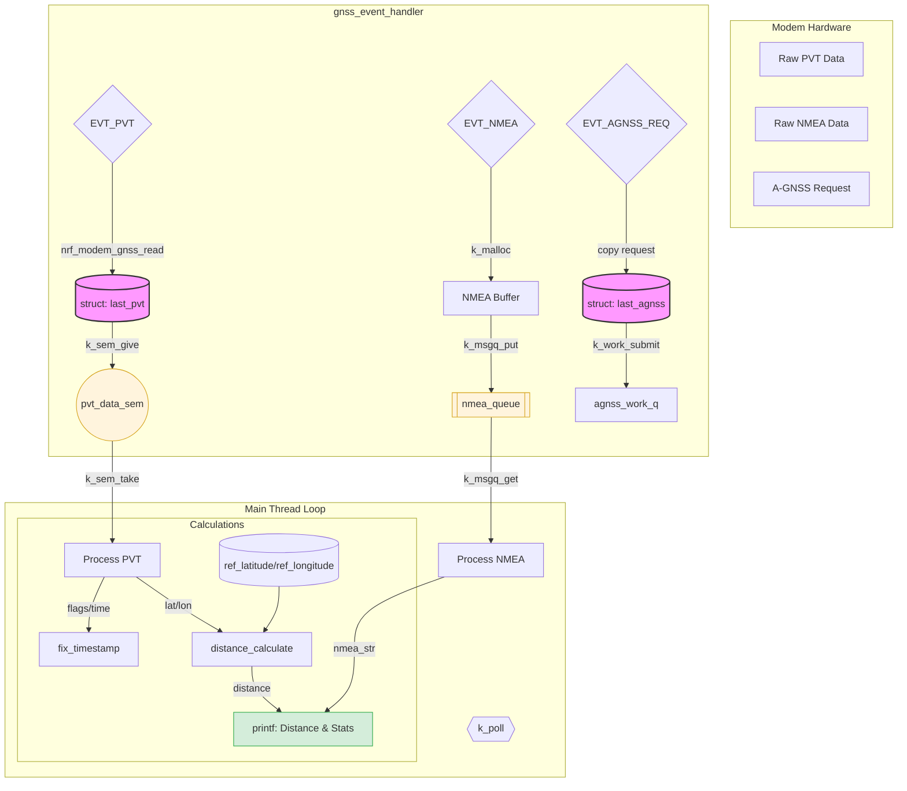

# Data flow

```mermaid
graph TD
    %% Source Data from Modem
    subgraph Modem_Layer [Modem Hardware]
        RAW_PVT[Raw PVT Data]
        RAW_NMEA[Raw NMEA Data]
        AGNSS_REQ[A-GNSS Request]
    end

    %% Event Handler Logic
    subgraph Handler [gnss_event_handler]
        direction TB
        EV_PVT{EVT_PVT} --> |nrf_modem_gnss_read| last_pvt[(struct: last_pvt)]
        last_pvt --> |k_sem_give| pvt_data_sem((pvt_data_sem))

        EV_NMEA{EVT_NMEA} --> |k_malloc| nmea_mem[NMEA Buffer]
        nmea_mem --> |k_msgq_put| nmea_queue[[nmea_queue]]

        EV_AGNSS{EVT_AGNSS_REQ} --> |copy request| last_agnss[(struct: last_agnss)]
        last_agnss --> |k_work_submit| agnss_work_q
    end

    %% Main Processing Loop
    subgraph Main_Loop [Main Thread Loop]
        direction TB
        k_poll{{k_poll}}
        
        pvt_data_sem --> |k_sem_take| Process_PVT[Process PVT]
        nmea_queue --> |k_msgq_get| Process_NMEA[Process NMEA]

        subgraph Calculations
            Process_PVT --> |lat/lon| dist_calc[distance_calculate]
            ref_lat_lon[(ref_latitude/ref_longitude)] --> dist_calc
            dist_calc --> |distance| Print_Screen[printf: Distance & Stats]
            
            Process_PVT --> |flags/time| fix_timestamp[fix_timestamp]
        end

        Process_NMEA --> |nmea_str| Print_Screen
    end

    %% Styling
    style last_pvt fill:#f9f,stroke:#333,stroke-width:2px
    style last_agnss fill:#f9f,stroke:#333,stroke-width:2px
    style pvt_data_sem fill:#fff4dd,stroke:#d4a017
    style nmea_queue fill:#fff4dd,stroke:#d4a017
    style Print_Screen fill:#d4edda,stroke:#28a745
```