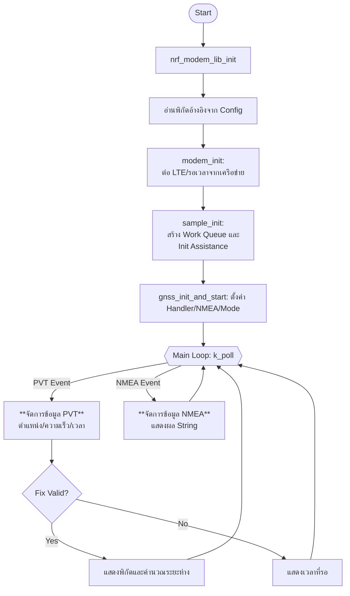
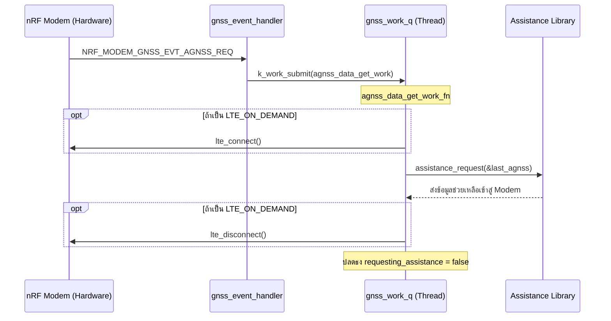

# Main GNSS workflow

# A-GNSS

**ส่วนประกอบ,หน้าที่หลัก**
- pvt_data_sem,สัญญาณบอกว่ามีข้อมูลตำแหน่งใหม่ (PVT) เข้ามาแล้ว
- nmea_queue,คิวเก็บข้อมูล NMEA String ที่ได้รับจาก Modem
- gnss_work_q,Thread แยกสำหรับจัดการงานที่ใช้เวลานาน (เช่น ขอ A-GNSS หรือ TTFF Test)
- distance_calculate,ใช้สูตร Haversine เพื่อหาระยะทางจากจุดอ้างอิง

